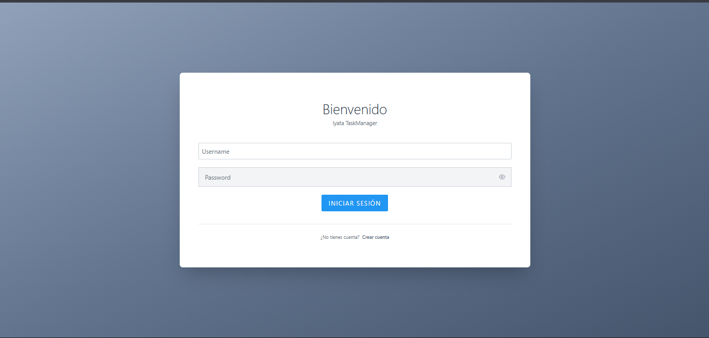
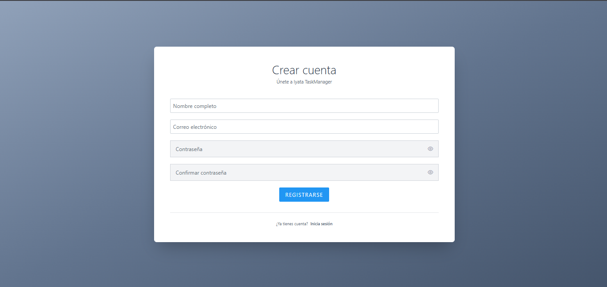
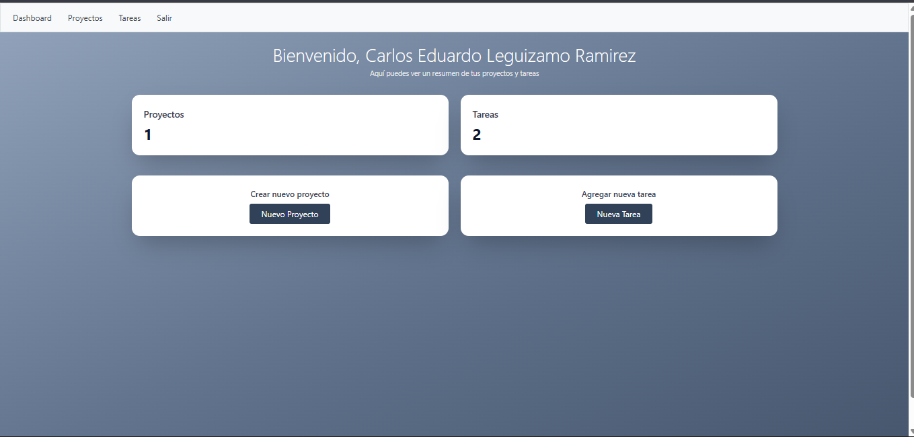
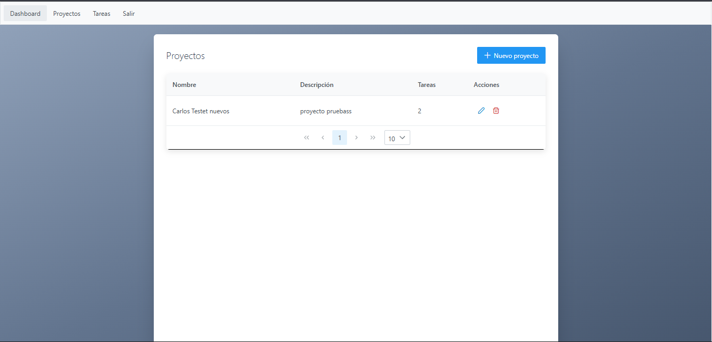
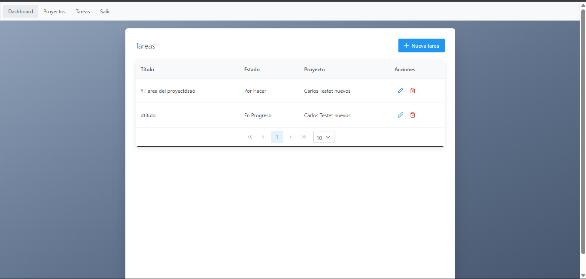

# Gestor de Proyectos y Tareas - Prueba Técnica Iyata

Este proyecto es un gestor de proyectos y tareas desarrollado con **Laravel (backend)** y **Vue 3 + Vite + TailwindCSS (frontend)**.

## Requisitos

- Node.js >= 18
- npm >= 9
- PHP >= 8.1
- Composer
- MySQL

---

## Instalación y ejecución

### 1. Clona el repositorio

```bash
git clone https://github.com/Carlos-Leguizamo/iyata-taskmanager.git
cd iyata-taskmanager
```

---

### 2. Backend (Laravel)

#### a. Instala dependencias

```bash
cd backend
composer install
```

#### b. Copia y configura el archivo de entorno

```bash
cp .env.example .env
```

- Configura tus credenciales de base de datos en `.env`:

  ```
  DB_CONNECTION=mysql
  DB_HOST=tu_host
  DB_DATABASE=iyata_taskmanager
  DB_USERNAME=tu_usuario
  DB_PASSWORD=tu_password
  ```

#### c. Genera la clave de la aplicación

```bash
php artisan key:generate
```

#### d. Ejecuta las migraciones

```bash
php artisan migrate 
```

#### e. Inicia el servidor de desarrollo

```bash
php artisan serve
```

- El backend estará disponible en: `http://127.0.0.1:8000`

---

### 3. Frontend (Vue 3 + Vite)

#### a. Instala dependencias

```bash
cd ../fronted
npm install
```

#### b. Configura la variable de entorno para la URL del backend

Crea un archivo `.env` en la carpeta `fronted` (raiz del proyecto) con el siguiente contenido:

```
VITE_API_BASE=http://localhost:8000/api
```

> **Nota:** Si el backend corre en otro puerto o dominio, actualiza la URL.

#### c. Inicia el servidor de desarrollo

```bash
npm run dev
```

- El frontend estará disponible en: `http://localhost:5173` (o el puerto que indique Vite).

---

## Uso

- Accede al frontend en tu navegador.
- Crea y gestiona proyectos, y dentro de ellos, las tareas correspondientes.
- La comunicación entre frontend y backend se realiza mediante la variable de entorno `VITE_API_BASE_URL`.

---

## Personalización

- Para cambiar la URL del backend, edita el archivo `.env` en `fronted`.
- Los estilos están basados en TailwindCSS.
- La configuración de TailwindCSS está en frontend/tailwind.config.js
- La API base se define en frontend/.env

---

## Troubleshooting

- Si tienes problemas de CORS, asegúrate de configurar correctamente los headers en Laravel.
- Si cambias la URL del backend, reinicia el servidor de Vite.
- Migraciones fallan: verifica que la base de datos exista y las credenciales en .env sean correctas.

---

---

## Proyecto funcional 

- Login



- Registro 



- Dashboard 



- Seecion de Proyectos



- Seccion de Tareas



---
---

**Desarrollado por: Carlos Leguizamo**